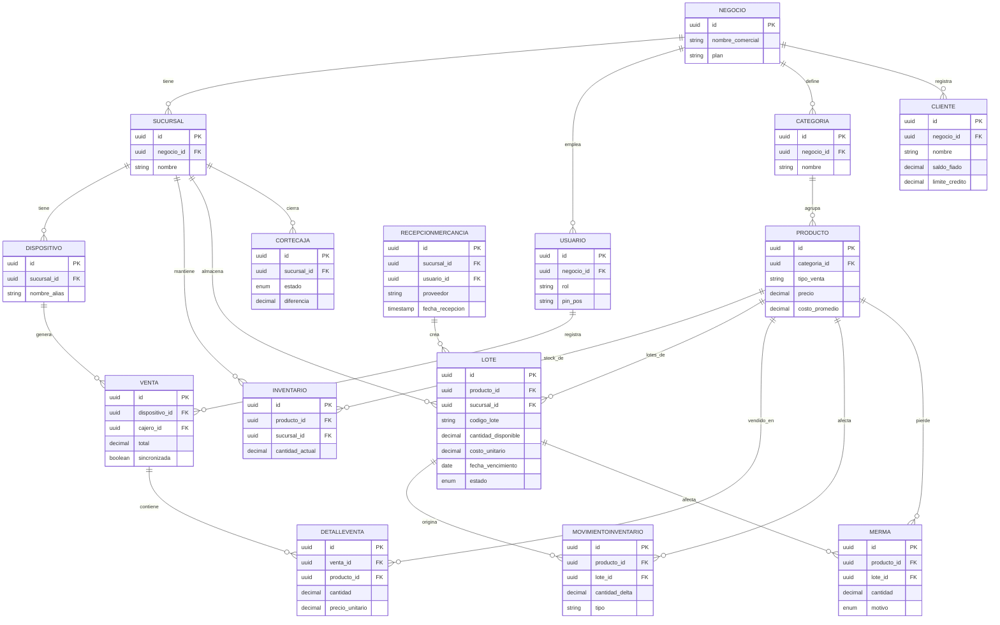
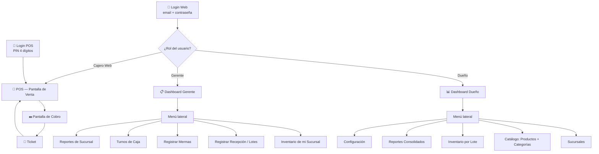
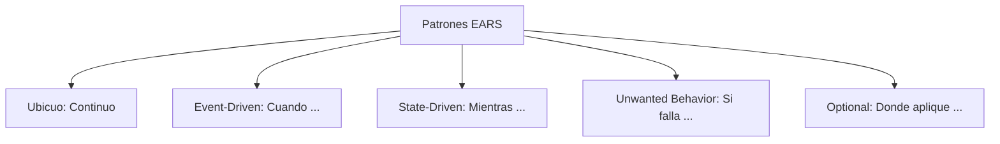

# Documento de Diseño de Software (SDD)
## Sistema POS Multi-Sucursal para Carnicerías
**Web + Móvil · Arquitectura Offline-First · Multi-negocio / Multi-sucursal**

Versión 1.0

---

## 1. Introducción

### 1.1 Contexto y Objetivo de Negocio
- **¿Qué se construye?:** Un sistema POS (Punto de Venta) integral, multi-tenant y multi-sucursal, disponible en formato Web (con modo dual: Panel Administrativo + Terminal POS de Mostrador) y Aplicación Móvil/Tablet (Android/iOS), con arquitectura offline-first nativa.
- **¿Para quién es?:** Redes de carnicerías, frigoríficos, salsamentarias y negocios cárnicos minoristas/mayoristas independientes o con múltiples sucursales físicas, donde operan dueños de negocio, administradores de sucursal y cajeros/despostadores de mostrador.
- **¿Qué problema de negocio resuelve?:**
  1. **Caídas de red y lucro cesante:** En carnicerías tradicionales, una interrupción del servicio de internet paraliza el cobro, genera filas y pérdidas económicas inmediatas. Este sistema garantiza continuidad 100% operativa sin red.
  2. **Venta mixta por peso y unidad con mermas complejas:** El corte de carnes involucra pesaje decimal de alta precisión (gramos), tara de empaques y mermas naturales (desposte, grasa, hueso, evaporación). El sistema formaliza la captura directa de báscula y el balance delta de inventario en tiempo real.
  3. **Control y centralización multi-sucursal:** Permite al dueño o franquiciador gestionar precios, catálogo e inventario consolidado sin desplazarse físicamente a cada punto de venta, manteniendo aislamiento riguroso entre empresas.

### 1.2 Propósito y Alcance del Documento
Este documento define las **reglas de negocio, requerimientos funcionales y comportamiento esperado del software sin enfocarse en código**, constituyendo la especificación formal y determinista para el desarrollo humano y asistido por IA.

El alcance cubre:
- Venta en mostrador en terminales táctiles (Tablet), móviles y PC/Laptop (Web POS) con soporte para productos por peso (3 decimales) y por unidad.
- Control de inventario por deltas y gestión estructurada de mermas operativas.
- Administración multi-tenant con aislamiento estricto por negocio y sucursal.
- Sincronización offline-first bidireccional idempotente.
- Apertura, monitoreo y corte de caja con conciliación de métodos de pago.
- Integración con periféricos estándar: básculas electrónicas (Web Serial/Bluetooth/Serial), impresoras térmicas ESC/POS y lectores de código de barras.

### 1.3 Definiciones y Siglas

| Término | Definición |
|---|---|
| POS | Point of Sale, terminal de venta en mostrador. |
| Tenant / Negocio | Empresa cliente del sistema (una carnicería o cadena). |
| Sucursal | Punto físico de venta perteneciente a un negocio. |
| Offline-first | Diseño donde la app funciona de forma autónoma sin red y sincroniza al recuperar conexión. |
| Merma | Pérdida de producto por corte, procesamiento o vencimiento. |
| CRDT | Conflict-free Replicated Data Type, estructura para resolver conflictos de sincronización. |

---

## 2. Vista General del Sistema

El sistema se compone de frentes de usuario versátiles y un backend central:

- **App POS móvil/tablet (offline-first)**: instalada en tablets o celulares de mostrador para pesar, cobrar e imprimir tickets sin conexión obligatoria.
- **Aplicación Web dual (Admin + POS Web de mostrador)**:
  - **Módulo POS Web (PWA / Offline-first)**: permite operar una caja registradora directamente desde el navegador de una PC/laptop o pantalla táctil en tienda, utilizando IndexedDB y Service Workers para operar 100% offline con soporte de Web Serial API / Web Bluetooth para básculas e impresoras.
  - **Panel de Administración Web**: gestión global de negocios, sucursales, productos, precios, usuarios, inventarios consolidados y reportes analíticos.
- **App móvil de gerencia** (mismo código base React Native): consulta rápida de ventas e inventario en tiempo real desde el celular del dueño/gerente.
- **Backend central (API + sincronización)**: fuente de verdad, multi-tenant, expone API a todos los frentes.

Cada carnicería (tenant) puede tener una o varias sucursales. Cada sucursal puede tener múltiples cajas (tablets, móviles o PCs con el POS Web) operando en simultáneo, incluso sin internet, sincronizando automáticamente al recuperar conectividad.

### 2.1 Los contextos de uso del sistema

El sistema comparte el mismo backend, el mismo modelo de datos y el mismo sistema de diseño (colores, tipografía, componentes), adaptándose a cada contexto de operación:

| | **App Tablet (POS)** | **App Móvil** | **Web: POS de Mostrador (PC/Laptop)** | **Web: Panel Admin** |
|---|---|---|---|---|
| **Ancho de referencia** | ~768–1200px, horizontal | ~375–430px | >1024px (pantalla mostrador/laptop) | >1200px (escritorio) |
| **Usuario** | Cajero, en mostrador | Cajero de respaldo / Gerente | Cajero / Dependiente de carnicería | Dueño / Administrador / Gerente |
| **Uso principal** | Venta táctil: pesar, cobrar, ticket | Respaldo si falla tablet; consulta móvil | Venta fluida con teclado/mouse/táctil, lectura de báscula e impresión de ticket | Gestión integral de sucursales, catálogo, precios, usuarios y reportes |
| **Prioridad de diseño** | Máxima — flujo crítico de venta. Botones grandes, alto contraste, 3 toques | Flujo en pasos optimizado para una sola columna | Catálogo amplio en pantalla, atajos de teclado (F1-F12), integración con lector y báscula | Navegación lateral, tablas densas, gráficos ejecutivos y formularios |
| **Conectividad** | Offline-first obligatorio | Offline-first para venta | **Offline-first obligatorio** (IndexedDB + Service Workers) | Requiere conexión |
| **Tecnología** | React Native + WatermelonDB | React Native | Next.js (React) + IndexedDB / RxDB + Web APIs | Next.js (React) + TypeScript |

**Por qué el POS Web complementa la solución:** Permite que cualquier carnicería use una computadora de escritorio o laptop existente en mostrador como caja registradora sin obligar a comprar tablets Android/iOS, manteniendo la misma garantía offline-first y compatibilidad con el hardware de mostrador.

---

## 3. Arquitectura del Sistema

### 3.1 Estilo arquitectónico
Se recomienda una arquitectura de **"monolito modular"** en el backend (no microservicios desde el día uno): más rápido de construir, más barato de operar, y suficiente para el volumen típico de una red de carnicerías. Los módulos (ventas, inventario, usuarios, sincronización, reportes) se separan por dominio dentro de la misma aplicación, para poder extraerlos como microservicios más adelante si el negocio crece mucho (ej. cientos de sucursales).

### 3.2 Componentes principales

| Componente | Responsabilidad |
|---|---|
| App POS (móvil/tablet) | Venta, pesaje, cobro, impresión, funcionamiento 100% offline con cola local de operaciones. |
| Motor de Sincronización | Empaqueta operaciones locales, las envía al backend, resuelve conflictos y trae cambios de otras sucursales. |
| API Backend (NestJS) | Lógica de negocio, autenticación, reglas de inventario/precios, multi-tenant. |
| Base de datos central (PostgreSQL) | Fuente de verdad; una fila por negocio (tenant_id) con aislamiento a nivel de fila. |
| Cache / Colas (Redis) | Sesiones, cache de catálogo, colas de sincronización y notificaciones. |
| Panel Web (Next.js/React) | Administración, reportes, configuración de negocios y sucursales. |
| Almacenamiento de archivos (S3) | Fotos de producto, comprobantes, reportes exportados. |

### 3.3 Diagrama de despliegue (descripción textual)
App POS (tablet, SQLite local) ⇄ Motor de sincronización ⇄ API Gateway/Load Balancer ⇄ Backend NestJS (contenedores) ⇄ PostgreSQL (RDS Multi-AZ) + Redis + S3. El Panel Web y la App de gerencia consumen la misma API. Un servicio de colas (BullMQ sobre Redis) procesa sincronizaciones y genera reportes pesados en segundo plano.

### 3.4 Pilares de Arquitectura Backend y Patrones de Acceso
1. **Patrones de Acceso (Access Patterns):**
   - *Fan-out (Alta Lectura):* Catálogo cacheado en Redis (Cache-Aside con TTL de 1h) con invalidación inmediata al editar productos. Assets estáticos y fotos en CDN (Vercel Edge / CloudFront).
   - *Fan-in (Alta Escritura):* Sincronización offline encolada en Redis + BullMQ (`sales-sync-queue`) con respuesta HTTP 202 inmediata y procesamiento desacoplado para no saturar la base de datos central.
2. **APIs Robustas e Idempotencia:** Claves de idempotencia obligatorias (UUID del cliente) en `/sales/sync`, semántica estricta de verbos HTTP, paginación por cursores (`cursor-based pagination`) y separación de Autenticación (JWT/PIN) vs Autorización (Guards RBAC).
3. **Transaccionalidad ACID y Teorema CAP:**
   - Agrupación atómica completa (`prisma.$transaction`) para Venta + Detalles + Pago + Deltas de Stock + Deducción FEFO de Lotes. Rollback automático ante cualquier excepción.
   - En terminales POS se prioriza **AP (Alta Disponibilidad y Tolerancia a Particiones)** permitiendo la venta offline, con convergencia de consistencia eventual mediante deltas en el servidor.
4. **Resiliencia ante Fallos:** Timeouts estrictos de 5000ms en llamadas externas, Circuit Breakers ante degradación de servicios, y Bulkheads separando los pools de conexiones de Supavisor (pool de ventas transaccionales aislado del pool de reportes analíticos).
5. **Observabilidad Avanzada:** Logs canónicos estructurados en JSON (`pino-http`), Correlation IDs (`X-Correlation-ID`) propagados en toda la traza de la petición y colas, e instrumentación para métricas OpenTelemetry/Prometheus.
6. **Monolito Modular con DDD:** Organización en Bounded Contexts (`AuthContext`, `SalesContext`, `InventoryContext`, `CashContext`) comunicados mediante eventos de dominio en memoria (`EventEmitter2`) para facilitar la extracción futura a microservicios independientes.

---

## 4. Diseño Offline-First (crítico)

Este es el requisito más delicado del sistema: la caja no puede detenerse porque se cae el internet.

### 4.1 Estrategia
- Cada dispositivo POS mantiene una base de datos local (SQLite) con el catálogo, precios e inventario de su sucursal, descargados y actualizados periódicamente.
- Toda venta se registra primero en local, con un identificador único generado en el dispositivo (UUID) y marca de tiempo.
- Las operaciones se guardan en una "cola de sincronización" local; un proceso en segundo plano las envía al backend apenas hay red.
- El backend aplica las operaciones de forma idempotente (usando el UUID) para evitar ventas duplicadas si se reintenta el envío.

### 4.2 Resolución de conflictos
El conflicto más común es el inventario: dos sucursales o dos cajas de la misma sucursal descuentan el mismo producto sin verse entre sí. Se recomienda:

- El inventario se descuenta por sucursal, no de forma global, evitando la mayoría de los conflictos entre sucursales distintas.
- Dentro de una misma sucursal, el inventario se trata como un contador incremental (se envían "deltas": -1.250 kg vendidos) en vez de un valor absoluto, para que dos cajas offline puedan aplicar sus cambios sin pisarse.
- Si el stock resultante queda negativo tras sincronizar, se genera una alerta de "venta con inventario negativo" para que el gerente la revise, en vez de bloquear la venta (bloquear ventas en carnicería por un tema de stock es peor negocio que ajustar después).

### 4.3 Tecnología recomendada para el motor de sync
WatermelonDB (si se usa React Native) o RxDB, ambas diseñadas específicamente para apps offline-first con SQLite local y sincronización incremental. Alternativa más simple de implementar a mano: una tabla de "outbox" de eventos + endpoint `/sync/push` y `/sync/pull` versionado por marca de tiempo ("sync tokens").

> **Nota:** si se opta por Flutter en vez de React Native (ver sección 5), el equivalente sería Drift (SQLite) + una capa de sincronización propia, o el framework Brick.

---

## 5. Stack Tecnológico Recomendado

| Capa | Tecnología | Motivo |
|---|---|---|
| **App POS Móvil / Tablet** | React Native + WatermelonDB (SQLite) | Comparte lenguaje/tipos con el backend y el panel web; WatermelonDB es una librería madura para offline-first en iOS/Android. |
| **App Web (Admin + POS Web)** | Next.js (React) + TypeScript + IndexedDB / RxDB · **Despliegue en Vercel** | Optimización nativa en Vercel para SSR/Edge; persistencia offline local mediante IndexedDB / Service Workers en mostrador. Dockerizable para desarrollo local y contenedores alternos. |
| **Backend / API** | Node.js + NestJS (TypeScript) · **Dockerizado** | Estructura modular limpia, soporte nativo de microservicios y multi-tenant. Empaquetado en contenedor Docker multi-stage. |
| **Base de datos** | **PostgreSQL en Supabase** | PostgreSQL 15+ gestionado, con soporte nativo de Row Level Security (RLS) para aislamiento multi-tenant estricto por fila, connection pooling (Supavisor) y SSL obligatorio (`sslmode=require`). |
| **Cache / Colas** | Redis (Upstash / Redis Docker) + BullMQ | Sesiones, colas de sincronización offline asíncronas y generación de reportes pesados. |
| **Contenedores y Entorno** | **Docker & Docker Compose** | Dockerización completa del ecosistema (Backend, Frontend y Redis) para paridad exacta entre entornos de desarrollo, staging y producción. |
| **Autenticación** | JWT + Refresh Tokens (HTTP-Only cookies en Web / Storage seguro en Móvil) | Sesiones seguras y prolongadas para terminales offline sin exponer credenciales en Javascript plano. |
| **Infraestructura & CI/CD** | Vercel (Frontend Web) + Contenedores Cloud / VPS (Backend) + Supabase | Despliegue continuo automatizado con Git Integration. Cero credenciales hardcodeadas (gestión vía Vercel Environment Variables y GitHub Secrets). |
| **Hardware POS** | Básculas (Bluetooth/serial), impresoras térmicas ESC/POS, lector de código de barras | Estándar de la industria de carnicerías/retail. En Web: Web Serial API / Web Bluetooth API. En Móvil: react-native-serialport / BluetoothManager. |

> **Estrategia de Conexión y Despliegue en Vercel:**
> - La aplicación web Next.js se conecta al Backend NestJS a través de la variable de entorno `NEXT_PUBLIC_API_URL` configurada en el panel de Vercel.
> - El despliegue se realiza de forma declarativa mediante Vercel Git Integration (conectado a la rama `main` o `develop`) o vía Vercel CLI en pipelines CI/CD utilizando el secreto `VERCEL_TOKEN` inyectado en variables seguras (nunca en código fuente ni commits).
>
> **Arquitectura de Backend Unificado (Web + Móvil):**
> - Se utiliza **un solo y único Backend central en NestJS** para todos los clientes (Web Admin, Web POS, Tablet POS y App Móvil). Todos los frentes consumen exactamente los mismos endpoints REST (`/auth/login`, `/catalog/sync`, `/sales/sync`, `/reports/sales`).
> - La única diferencia operativa radica en el almacenamiento local offline del cliente: **SQLite (WatermelonDB)** en la App Móvil/Tablet vs. **IndexedDB (Dexie/RxDB)** en la App Web. Ambos sincronizan hacia el mismo endpoint `/sales/sync` al recuperar conexión.
>
> **Dualidad de Cadenas de Conexión a Supabase (DATABASE_URL vs DIRECT_URL):**
> 1. `DATABASE_URL` (Puerto 6543 - Supavisor / Transaction Pooler): Utilizada por el backend NestJS para la operación transaccional concurrente (ventas, cobros, consultas). Reutiliza un pool de conexiones para evitar agotar la memoria de PostgreSQL ante alto tráfico.
> 2. `DIRECT_URL` (Puerto 5432 - Session Mode): Utilizada exclusivamente por Prisma CLI para ejecutar migraciones DDL (`prisma migrate`, `ALTER TABLE`, creación de índices) que requieren comandos de sesión bloqueados por el pooler. Ambos strings apuntan a la misma y única base de datos.

**Alternativa de app móvil — Flutter:** válida si priorizas rendimiento en tablets Android de gama baja y consistencia visual entre dispositivos por encima de compartir código con el backend en TypeScript. Ver comparación detallada en la conversación.

> Nota sobre básculas: no existe un protocolo único; cada marca (Torrey, CAS, Toledo, etc.) tiene su propio driver. Se recomienda definir una capa de abstracción ("driver de báscula") en la app para poder soportar varias marcas sin tocar el resto del código.

---

## 6. Modelo de Datos

### 6.1 Convenciones generales
- Todas las claves primarias son **UUID** (no autoincrementales), porque las entidades transaccionales (Venta, MovimientoInventario, Merma) se generan **en el dispositivo, sin conexión**, y un ID autoincremental de base de datos no se puede asignar offline.
- Los montos de dinero se guardan como `decimal(12,2)`. Los pesos/cantidades como `decimal(10,3)` (permite hasta gramos de precisión, ej. `1.375` kg).
- Toda entidad transaccional (Venta, DetalleVenta, MovimientoInventario, Merma, CorteDeCaja) tiene `fecha_hora_dispositivo` (generada offline) y `fecha_hora_servidor` (asignada al sincronizar) — nunca se confían para orden cronológico exacto entre dispositivos distintos, solo dentro del mismo dispositivo.

### 6.2 Entidades "de catálogo" (se descargan al dispositivo, se editan desde el panel web)

**Negocio (Tenant)**
| Campo | Tipo | Notas |
|---|---|---|
| id | UUID (PK) | |
| nombre_comercial | string | |
| razon_social | string | |
| nit_rut | string | Identificación fiscal |
| plan | enum(basico, pro, enterprise) | Controla límites (nº sucursales, usuarios) |
| activo | boolean | |
| fecha_registro | timestamp | |

**Sucursal**
| Campo | Tipo | Notas |
|---|---|---|
| id | UUID (PK) | |
| negocio_id | UUID (FK → Negocio) | |
| nombre | string | Ej. "Sede Norte" |
| direccion, ciudad | string | |
| zona_horaria | string | Importante si el negocio tiene sucursales en distintas zonas |
| activo | boolean | |

**Rol**
| Campo | Tipo | Notas |
|---|---|---|
| id | UUID (PK) | |
| nombre | string | Administrador, Gerente Sucursal, Cajero |
| permisos | JSON (array de strings) | Ej. `["ventas.crear","inventario.ajustar","reportes.ver"]` |

**Usuario**
| Campo | Tipo | Notas |
|---|---|---|
| id | UUID (PK) | |
| negocio_id | UUID (FK → Negocio) | |
| sucursal_id | UUID (FK → Sucursal, nullable) | Nulo si es admin a nivel de todo el negocio |
| rol_id | UUID (FK → Rol) | |
| nombre_completo | string | |
| email | string (unique) | Login del panel web |
| password_hash | string | |
| pin_pos | string (hash) | PIN corto de 4 dígitos para iniciar sesión rápido **offline** en el POS |
| activo | boolean | |

**Categoria**
| Campo | Tipo | Notas |
|---|---|---|
| id | UUID (PK) | |
| negocio_id | UUID (FK) | |
| nombre | string | Ej. Res, Cerdo, Pollo, Embutidos, Otros |
| orden_visualizacion | int | Orden de los botones en la app POS |

**Producto**
| Campo | Tipo | Notas |
|---|---|---|
| id | UUID (PK) | |
| negocio_id | UUID (FK) | |
| categoria_id | UUID (FK) | |
| nombre | string | |
| codigo_barras | string (nullable) | |
| tipo_venta | enum(peso, unidad) | Define si la app pide peso de báscula o cantidad |
| unidad_medida | enum(kg, g, unidad) | |
| precio | decimal(12,2) | Precio por kg o por unidad según `tipo_venta` |
| costo_promedio | decimal(12,2) | Para calcular margen en reportes |
| foto_url | string (nullable) | |
| activo | boolean | |

### 6.3 Entidades operativas (viven en cada sucursal)

**Inventario**
| Campo | Tipo | Notas |
|---|---|---|
| id | UUID (PK) | |
| producto_id | UUID (FK) | |
| sucursal_id | UUID (FK) | Un mismo producto tiene una fila de inventario **por sucursal** |
| cantidad_actual | decimal(10,3) | Valor "snapshot", se recalcula a partir de MovimientoInventario |
| cantidad_minima_alerta | decimal(10,3) | Dispara alerta de reabastecimiento |
| version | int | Contador optimista, se incrementa en cada sincronización aplicada |
| ultima_actualizacion | timestamp | |

**MovimientoInventario** — *la tabla más importante para el offline-first*
| Campo | Tipo | Notas |
|---|---|---|
| id | UUID (PK, generado en el dispositivo) | |
| producto_id | UUID (FK) | |
| sucursal_id | UUID (FK) | |
| dispositivo_id | UUID (FK) | |
| tipo | enum(venta, merma, recepcion, ajuste_manual, devolucion) | |
| cantidad_delta | decimal(10,3) | **Siempre un delta**, nunca un valor absoluto (positivo o negativo) |
| referencia_id | UUID (nullable) | Apunta a Venta.id o Merma.id según el tipo |
| lote_id | UUID (FK → Lote, nullable) | Lote específico afectado por este movimiento (nullable para movimientos previos a implementación de lotes) |
| usuario_id | UUID (FK) | |
| fecha_hora_dispositivo | timestamp | |
| fecha_hora_servidor | timestamp (nullable) | Se llena al sincronizar |
| sincronizado | boolean | |

**Merma**
| Campo | Tipo | Notas |
|---|---|---|
| id | UUID (PK) | |
| producto_id | UUID (FK) | |
| sucursal_id | UUID (FK) | |
| lote_id | UUID (FK → Lote, nullable) | Lote específico del que proviene la merma (nullable para mermas previas a lotes) |
| dispositivo_id | UUID (FK → Dispositivo) | Dispositivo desde el que se registró la merma (necesario para sync offline) |
| cantidad | decimal(10,3) | |
| motivo | enum(corte_proceso, vencimiento, dano, robo, otro) | |
| usuario_id | UUID (FK) | |
| foto_evidencia_url | string (nullable) | |
| fecha_hora_dispositivo | timestamp | |

**Cliente** *(opcional — común para "fiado" en carnicerías de barrio)*
| Campo | Tipo | Notas |
|---|---|---|
| id | UUID (PK) | |
| negocio_id | UUID (FK) | |
| nombre, telefono | string | |
| saldo_fiado | decimal(12,2) | Saldo pendiente a crédito |
| limite_credito | decimal(12,2) | Cupo máximo de crédito asignado (requerido por EARS-VENTA-05 para validar cupo antes de venta fiado) |

**Venta**
| Campo | Tipo | Notas |
|---|---|---|
| id | UUID (PK, generado en el dispositivo) | Clave de idempotencia al sincronizar |
| sucursal_id | UUID (FK) | |
| dispositivo_id | UUID (FK) | |
| cajero_id | UUID (FK → Usuario) | |
| cliente_id | UUID (FK, nullable) | Solo si es venta a crédito/fiado |
| subtotal, descuento, total | decimal(12,2) | |
| metodo_pago | enum(efectivo, tarjeta, transferencia, fiado, mixto) | |
| estado | enum(completada, anulada) | Las ventas nunca se borran, se anulan (trazabilidad) |
| fecha_hora_dispositivo | timestamp | |
| fecha_hora_servidor | timestamp (nullable) | |
| sincronizada | boolean | |

**DetalleVenta**
| Campo | Tipo | Notas |
|---|---|---|
| id | UUID (PK) | |
| venta_id | UUID (FK) | |
| producto_id | UUID (FK) | |
| cantidad | decimal(10,3) | Peso (kg) o unidades |
| precio_unitario | decimal(12,2) | **Snapshot** del precio al momento de vender (el precio del catálogo puede cambiar después) |
| subtotal_linea | decimal(12,2) | |
| peso_bruto / peso_neto | decimal(10,3) (nullable) | Trazabilidad de báscula, útil ante reclamos |

**PagoVenta** *(soporta pagos mixtos: parte efectivo + parte tarjeta)*
| Campo | Tipo | Notas |
|---|---|---|
| id | UUID (PK) | |
| venta_id | UUID (FK) | |
| metodo | enum(efectivo, tarjeta, transferencia, fiado) | |
| monto | decimal(12,2) | |
| referencia_transaccion | string (nullable) | Voucher de datáfono, si aplica |

**CorteDeCaja**
| Campo | Tipo | Notas |
|---|---|---|
| id | UUID (PK) | |
| sucursal_id | UUID (FK) | |
| dispositivo_id | UUID (FK, nullable) | Nulo si es un corte consolidado de toda la sucursal |
| usuario_id | UUID (FK) | Quien realiza el cierre |
| estado | enum(abierta, cerrada) | Estado actual del turno de caja (requerido por EARS-CAJA-03 y EARS-CAJA-04 para controlar acceso a ventas) |
| fecha_apertura, fecha_cierre | timestamp | |
| monto_apertura | decimal(12,2) | Base de caja inicial |
| total_efectivo_esperado | decimal(12,2) | Calculado por el sistema |
| total_efectivo_contado | decimal(12,2) | Ingresado manualmente por el cajero |
| diferencia | decimal(12,2) | `contado - esperado` |
| totales_por_metodo_pago | JSON | `{"efectivo": 450000, "tarjeta": 210000, ...}` |
| observaciones | text (nullable) | |

**Lote** — *Trazabilidad de inventario a nivel de lote/batch*
| Campo | Tipo | Notas |
|---|---|---|
| id | UUID (PK) | Identificador único del lote |
| producto_id | UUID (FK → Producto) | Producto al que pertenece este lote |
| sucursal_id | UUID (FK → Sucursal) | Sucursal que recibió el lote |
| recepcion_id | UUID (FK → RecepcionMercancia, nullable) | Recepción que originó este lote (nullable para lotes migrados o de carga inicial) |
| codigo_lote | string | Código o número de lote del proveedor (ej. "L-2025-0912") |
| proveedor | string | Nombre del proveedor de este lote |
| cantidad_recibida | decimal(10,3) | Cantidad inicial recibida (kg o unidades) |
| cantidad_disponible | decimal(10,3) | Cantidad restante actual (se descuenta por FEFO en cada venta) |
| costo_unitario | decimal(12,2) | Costo de compra por kg o unidad para este lote |
| fecha_recepcion | timestamp | Cuándo se recibió la mercancía |
| fecha_vencimiento | date (nullable) | Fecha de caducidad (nulo si no aplica, ej. carbón, sal) |
| temperatura_recepcion | decimal(4,1) (nullable) | °C registrada al recibir (control de cadena de frío) |
| estado | enum(activo, agotado, vencido, retirado) | Estado actual del lote |
| notas | text (nullable) | Observaciones (ej. "Canales cortadas en media res") |
| fecha_hora_dispositivo | timestamp | Timestamp del dispositivo al registrar |
| sincronizado | boolean | ¿Ya se envió al servidor? |

**RecepcionMercancia** — *Agrupa la llegada de mercancía en un solo acto*
| Campo | Tipo | Notas |
|---|---|---|
| id | UUID (PK) | Identificador de la recepción |
| sucursal_id | UUID (FK → Sucursal) | Sucursal receptora |
| usuario_id | UUID (FK → Usuario) | Quién recibió la mercancía |
| proveedor | string | Nombre del proveedor |
| fecha_recepcion | timestamp | Fecha y hora de recepción |
| observaciones | text (nullable) | Notas generales de la recepción (ej. "Llegó el camión de ProveedorX con 5 productos") |
| fecha_hora_dispositivo | timestamp | Timestamp del dispositivo |
| sincronizado | boolean | Estado de sync |

> **Flujo completo del Inventario por Lote (FEFO):**
>
> 1. **RECEPCIÓN:** El gerente registra la llegada de mercancía → selecciona producto → ingresa cantidad (kg), costo unitario, proveedor, fecha de vencimiento, temperatura (opcional). Se crea: 1 `RecepcionMercancia` + N `Lotes` + N `MovimientosInventario` (tipo: `recepcion`, delta positivo).
> 2. **ALMACENAMIENTO:** El lote queda con `estado = activo` y `cantidad_disponible = cantidad_recibida`. Visible en el panel del gerente por sucursal.
> 3. **VENTA (FEFO automático):** Cuando un cajero vende 2.5 kg de "Lomo Fino", el sistema busca los lotes activos de ese producto en esa sucursal ordenados por `fecha_vencimiento ASC` (el que vence primero sale primero). Descuenta del primer lote; si es insuficiente, distribuye entre múltiples lotes. Genera `MovimientoInventario` con `lote_id` vinculado. **El cajero NO ve nada de esto — cero clics extra.**
> 4. **MERMA:** Si un lote se dañó o venció, el gerente registra la merma seleccionando el lote específico → motivo → cantidad → foto evidencia. Se descuenta de `cantidad_disponible` del lote.
> 5. **AGOTAMIENTO:** Cuando `cantidad_disponible` llega a `0.000`, el lote cambia automáticamente a `estado = agotado`.
> 6. **VENCIMIENTO AUTOMÁTICO:** Un proceso diario (o al cargar el dashboard) marca los lotes con `fecha_vencimiento < hoy` como `estado = vencido` y genera alerta al gerente.
> 7. **REPORTES:** El dueño consulta: lotes activos por producto/sucursal, margen real por lote (costo compra vs. precio venta), lotes próximos a vencer, historial de recepciones por proveedor.

### 6.4 Entidades de infraestructura de sincronización

**Dispositivo**
| Campo | Tipo | Notas |
|---|---|---|
| id | UUID (PK) | |
| sucursal_id | UUID (FK) | |
| nombre_alias | string | Ej. "Caja 1", "Tablet Mostrador" |
| modelo, sistema_operativo | string | |
| token_dispositivo | string | Usado para autenticar el sync sin depender de que el usuario esté logueado |
| ultima_sincronizacion | timestamp | |
| activo | boolean | |

**LogSincronizacion**
| Campo | Tipo | Notas |
|---|---|---|
| id | UUID (PK) | |
| dispositivo_id | UUID (FK) | |
| tipo_entidad | string | Ej. "Venta", "MovimientoInventario" |
| entidad_id | UUID | |
| accion | enum(crear, actualizar, eliminar) | |
| payload | JSON | Copia de los datos enviados, para auditoría/debug |
| estado | enum(pendiente, aplicado, conflicto, error) | |
| mensaje_error | text (nullable) | |
| fecha_intento | timestamp | |

### 6.5 Relaciones (resumen)

```
Negocio 1───N Sucursal
Negocio 1───N Usuario
Negocio 1───N Categoria ───N Producto
Sucursal 1───N Dispositivo
Sucursal 1───N Inventario ──1 Producto
Sucursal 1───N CorteDeCaja
Dispositivo 1───N Venta ───N DetalleVenta ──1 Producto
Venta 1───N PagoVenta
Producto 1───N MovimientoInventario
Producto 1───N Merma
Producto 1───N Lote
Usuario 1───N Venta (como cajero)
RecepcionMercancia 1───N Lote
Lote N───1 Producto
Lote N───1 Sucursal
MovimientoInventario N───0..1 Lote
Merma N───0..1 Lote
```

### 6.6 Diagrama entidad-relación

Entidades centrales y sus relaciones (se omiten `Rol`, `PagoVenta` y `LogSincronizacion` para mantener el diagrama legible; están detalladas en las secciones 6.2 a 6.4).



`Producto` es el centro de gravedad del modelo: conecta con `Inventario`, `DetalleVenta`, `MovimientoInventario` y `Lote`. `Dispositivo` (la tablet/caja) es dueño de la `Venta`, no la `Sucursal` directamente, para poder rastrear siempre desde qué caja física salió cada transacción. `MovimientoInventario` cuelga de `Producto` y opcionalmente de `Lote` porque también se genera por mermas, recepciones o ajustes manuales, no solo por ventas. `Lote` permite trazabilidad FEFO y cálculo de margen real por compra.

### 6.7 Qué vive offline vs. qué se descarga

| Se descarga al dispositivo (solo lectura local) | Se genera en el dispositivo y se sincroniza hacia el servidor |
|---|---|
| Negocio, Sucursal, Usuario, Rol | Venta, DetalleVenta, PagoVenta |
| Categoria, Producto | MovimientoInventario, Merma |
| Inventario (snapshot inicial) | CorteDeCaja |
| Lotes existentes (snapshot para consulta y FEFO) | Lote (nuevos, creados en recepción offline) |
| | RecepcionMercancia |

---

## 7. Diseño de Interfaces / API (resumen)

| Endpoint | Método | Descripción |
|---|---|---|
| `/auth/login` | POST | Autenticación de usuario/dispositivo, devuelve JWT + refresh token. |
| `/auth/refresh` | POST | Renovación de access token usando refresh token válido. |
| `/auth/pin-login` | POST | Validación de PIN de 4 dígitos para sesión POS (registro de sesión local). |
| `/catalog/sync` | GET | Descarga catálogo/precios/inventario inicial o incremental por sucursal (delta por sync token). |
| `/sales/sync` | POST | Envía lote de ventas generadas offline (idempotente por UUID). |
| `/sales/:id/void` | POST | Anulación de venta sincronizada con reversión de movimientos de inventario asociados. |
| `/products` | GET/POST/PATCH | CRUD de productos del catálogo (peso/unidad, precios, categoría). |
| `/categories` | GET/POST/PATCH | CRUD de categorías con orden de visualización para POS. |
| `/customers` | GET/POST/PATCH | Gestión de clientes (nombre, teléfono, saldo fiado, límite de crédito). |
| `/customers/:id/credit` | GET | Consulta de cupo de crédito disponible del cliente (`limite_credito - saldo_fiado`). |
| `/inventory/adjust` | POST | Ajustes manuales de inventario (mermas, devoluciones, correcciones). |
| `/branches` | GET/POST/PATCH | Gestión de sucursales de un negocio. |
| `/devices/register` | POST | Registro y autorización de nuevo dispositivo POS con generación de `token_dispositivo`. |
| `/devices/:id/heartbeat` | POST | Heartbeat de dispositivo activo, actualiza `ultima_sincronizacion`. |
| `/cash-shifts/open` | POST | Apertura de turno de caja con monto base inicial obligatorio. |
| `/cash-shifts/current` | GET | Estado actual del turno de caja activo en el dispositivo solicitante. |
| `/cash-cuts` | POST | Registro de corte de caja con monto contado y cálculo de diferencia. |
| `/lots` | GET/POST | Gestión de lotes de inventario por sucursal (listado filtrable por estado/producto). |
| `/lots/:id/movements` | GET | Historial de movimientos de inventario asociados a un lote específico. |
| `/lots/expiring` | GET | Lotes con `fecha_vencimiento` dentro de los próximos N días (parámetro `days`, default 3). |
| `/receptions` | POST | Registro de recepción de mercancía con creación automática de lotes y movimientos de entrada. |
| `/reports/sales` | GET | Reportes de ventas por sucursal/rango de fechas con desglose por categoría y método de pago. |
| `/dashboard/owner` | GET | Datos consolidados del dashboard de dueño: ventas, márgenes, alertas, comparativo de sucursales. |
| `/dashboard/manager` | GET | Datos del dashboard de gerente filtrado por su sucursal: ventas del turno, caja, inventario. |

> **Nota sobre seguridad de descarga de PIN:** Los hashes de PIN de cajeros se descargan **exclusivamente** a dispositivos con `token_dispositivo` válido y verificado. Los hashes se almacenan cifrados con AES-256 en la base de datos local del dispositivo (SQLite en móvil, IndexedDB cifrado en web). Un dispositivo solo puede acceder a los PINs de los usuarios asignados a su sucursal.

---

### 7.5 Dashboard Principal — Vistas por Rol

El dashboard es la **pantalla de inicio** para roles gerenciales. Su objetivo es ofrecer un resumen ejecutivo accionable que elimine la necesidad de navegar por múltiples reportes para entender el estado del negocio.

#### Dashboard del Dueño / Administrador (pantalla de inicio al loguearse)

| Widget | Datos que muestra | Fuente de datos |
|--------|-------------------|-----------------|
| 💰 **Ventas del día** (todas las sucursales) | Total consolidado, comparado con ayer y promedio semanal | `Venta` + `DetalleVenta` (sincronizadas) |
| 📊 **Margen bruto por categoría** | `(precio_venta - costo_promedio) / precio_venta × 100` por categoría cárnica | `DetalleVenta` + `Producto.costo_promedio` |
| 🏆 **Top 5 productos más vendidos** | Ranking por cantidad vendida (kg y unidades) del día/semana | `DetalleVenta` agrupado por producto |
| ⚠️ **Alertas de stock bajo** | Productos con `cantidad_actual ≤ cantidad_minima_alerta` por sucursal | `Inventario` |
| 🕐 **Lotes próximos a vencer** | Lotes con `fecha_vencimiento` dentro de los próximos 3 días | `Lote` (filtro: `estado = activo`) |
| 💳 **Desglose por método de pago** | Efectivo vs. tarjeta vs. transferencia vs. fiado (gráfico de dona) | `PagoVenta` agrupado |
| 🏪 **Comparativo de sucursales** | Tabla resumen: ventas, mermas y diferencias de caja por sucursal | Varias entidades |
| 🔄 **Última sincronización** | Timestamp de última sync exitosa por dispositivo activo | `Dispositivo.ultima_sincronizacion` |

#### Dashboard del Gerente de Sucursal (pantalla de inicio al loguearse)

| Widget | Datos que muestra |
|--------|-------------------|
| 💰 **Ventas del día** (mi sucursal) | Total, ticket promedio, número de transacciones del día |
| 🧾 **Estado de caja actual** | ¿Abierta/cerrada? Monto base, ventas acumuladas del turno activo |
| ⚠️ **Inventario crítico** | Productos bajo stock mínimo en mi sucursal |
| 🕐 **Lotes por vencer** | Lotes con vencimiento ≤ 3 días en mi sucursal |
| 📉 **Mermas del día** | Total de mermas registradas hoy con desglose por motivo |

#### Vista del Cajero (sin dashboard — acceso directo al POS)

El cajero al ingresar con PIN llega directamente a la **pantalla de venta** con el carrito vacío listo para operar. **Cero clics** para empezar a vender. El objetivo es máxima velocidad de atención.

---

### 7.6 Navegación, Flujo de Usuario y Directrices UX

#### 7.6.1 Mapa de Navegación por Rol



#### 7.6.2 Flujo de Venta (Cajero) — Máximo 3 Toques

El flujo de venta está diseñado para **velocidad máxima** en el mostrador de carnicería:

```
Toque 1: SELECCIONAR PRODUCTO
  → Grid de botones grandes con foto, nombre y precio
  → Organizados por categoría (Res, Cerdo, Pollo, Embutidos, Otros)
  → Si es producto por peso: la báscula llena el peso automáticamente
  → Si es por unidad: cantidad = 1 por defecto (+ y − para ajustar)

Toque 2: CONFIRMAR LÍNEA
  → Se agrega al carrito visible en el panel lateral (derecha o inferior)
  → El carrito muestra subtotal actualizado en tiempo real
  → Se puede seguir agregando productos (volver a Toque 1)

Toque 3: COBRAR
  → Tocar botón "Cobrar" → Pantalla de pago
  → Monto total visible en grande, fuente ≥ 48px
  → Botones rápidos: "Efectivo exacto" | "Tarjeta" | "Transferencia"
  → Si pago mixto: seleccionar métodos y montos parciales
  → Tocar "Confirmar Pago" → Ticket se imprime → POS regresa limpio
```

#### 7.6.3 Flujo de Recepción de Mercancía / Lotes (Gerente)

```
1. Dashboard Gerente → Menú lateral → "Registrar Recepción"
2. Seleccionar proveedor (campo de texto con autocompletado de proveedores previos)
3. Para cada producto recibido:
   → Buscar producto por nombre o código de barras
   → Ingresar: cantidad (kg o unidades), costo unitario, fecha de vencimiento
   → Opcional: temperatura de recepción, código de lote del proveedor, notas
4. Confirmar recepción → Se crean automáticamente:
   → 1 RecepcionMercancia + N Lotes + N MovimientosInventario (tipo: recepcion)
5. Se puede consultar el lote recién creado en "Inventario de mi Sucursal"
```

#### 7.6.4 Directrices UX Obligatorias

| Directriz | Especificación |
|-----------|----------------|
| **Navegación principal** | Menú lateral (sidebar) persistente con íconos + texto. Colapsable a solo íconos en tablet/móvil. Máximo **7 opciones** de primer nivel por rol. |
| **Breadcrumbs** | Presentes en todas las vistas de administración (ej. `Inicio > Inventario > Lotes > Lote L-2025-0912`). **NO** en el POS de venta (el cajero no navega, opera). |
| **Búsqueda global** | Barra de búsqueda en la parte superior del panel admin. Busca productos, clientes, ventas por ID, lotes por código. Accesible con `Ctrl+K` / `Cmd+K`. |
| **Responsive** | Desktop (sidebar + contenido), tablet (sidebar colapsada + contenido full), móvil (bottom navigation + contenido full-width). Tres layouts distintos, no solo reflow. |
| **Botones táctiles** | Tamaño mínimo **48×48 px** para botones de acción. En el POS: botones de **64×64 px** mínimo con alto contraste WCAG AAA. |
| **Formularios mínimos** | Recepción de lote: máximo **6 campos visibles**. Campos opcionales (temperatura, notas) en sección colapsable "Más detalles". |
| **Validación en tiempo real** | Errores mostrados inline debajo del campo conforme el usuario escribe. Bordes rojos + ícono ⚠️ + mensaje descriptivo. No esperar al envío del formulario. |
| **Indicador de fortaleza de contraseña** | Barra visual con 4 niveles (débil / regular / fuerte / muy fuerte) al crear o cambiar contraseña en el panel web. |
| **Acceso inmediato post-registro** | Tras el primer login del dueño, un onboarding guiado lo lleva a crear su primera sucursal y primer producto en **máximo 3 pasos**. |
| **Feedback visual** | Toast notifications: éxito (verde), error (rojo), advertencia (ámbar). Duración: 3 segundos auto-dismiss. Las acciones destructivas (anular venta) piden confirmación con modal. |
| **Atajos de teclado (POS Web)** | `F1`–`F8`: categorías rápidas. `Enter`: cobrar. `Esc`: cancelar línea. `F12`: corte de caja. Indicados con tooltip al pasar el cursor. |
| **Modo offline visible** | Banner fijo superior ámbar con *"⚡ Modo Sin Conexión — N transacciones pendientes"* cuando no hay internet. Cambia a verde al reconectar y sincronizar. |

---

## 8. Historias de Usuario (User Stories)

Estructuradas bajo el formato clásico: **Como [rol], quiero [acción] para [beneficio]**, definiendo la experiencia integral de cada tipo de usuario:

### 8.1 Cajero / Operador de Mostrador
- **US-01:** *Como cajero en mostrador*, quiero ingresar al POS mediante un PIN de 4 dígitos sin conexión a internet, para iniciar mi turno de venta en menos de 5 segundos sin depender del servidor central.
- **US-02:** *Como cajero*, quiero capturar el peso exacto de la carne directamente desde la báscula conectada, para evitar digitación manual, errores de cobro y agilizar la atención en fila.
- **US-03:** *Como cajero*, quiero vender productos por peso (kg) o por unidad en una misma transacción, para cobrar cortes cárnicos y productos empacados (aderezos, carbón, embutidos) de forma unificada.
- **US-04:** *Como cajero*, quiero registrar pagos mixtos (combinar efectivo y tarjeta o transferencia), para brindar flexibilidad al cliente y cuadrar con precisión el dinero recibido.
- **US-05:** *Como cajero*, quiero que el sistema me permita seguir vendiendo sin interrupción aunque se caiga el internet, para no paralizar la atención ni perder ventas.
- **US-06:** *Como cajero*, quiero realizar el corte y cierre de caja al finalizar mi jornada, para comparar el dinero físico contado contra el valor esperado por el sistema.

### 8.2 Gerente de Sucursal
- **US-07:** *Como gerente de sucursal*, quiero registrar mermas operativas clasificadas por motivo (corte/desposte, vencimiento, daño, evaporación), para reflejar el inventario real y controlar el desperdicio.
- **US-08:** *Como gerente de sucursal*, quiero recibir alertas visibles cuando el inventario de un corte llegue al stock mínimo, para solicitar reabastecimiento antes de agotar existencia.
- **US-09:** *Como gerente de sucursal*, quiero auditar los cortes de caja y diferencias de efectivo por turno y cajero, para prevenir fugas y mantener la disciplina financiera.

### 8.3 Dueño del Negocio / Administrador General
- **US-10:** *Como dueño del negocio*, quiero gestionar múltiples sucursales y sus cajas desde el panel web, para tener visibilidad y control centralizado de toda la red comercial.
- **US-11:** *Como dueño del negocio*, quiero actualizar precios de catálogo en el panel web y que se distribuyan automáticamente a todas las cajas, para mantener políticas de precios uniformes.
- **US-12:** *Como dueño del negocio*, quiero consultar reportes de ventas consolidados y márgenes de ganancia por sucursal y categoría cárnica, para tomar decisiones estratégicas de abastecimiento.

### 8.4 Dashboard y Reportes
- **US-13:** *Como dueño del negocio*, quiero ver un dashboard al iniciar sesión que muestre ventas del día, margen bruto por categoría, alertas de stock bajo y lotes próximos a vencer, para tomar decisiones rápidas sin navegar por múltiples reportes.
- **US-14:** *Como gerente de sucursal*, quiero ver un resumen operativo de mi sucursal al entrar al sistema (ventas del turno, estado de caja, inventario crítico), para priorizar mis acciones del día sin clics adicionales.

### 8.5 Inventario por Lote
- **US-15:** *Como gerente de sucursal*, quiero registrar la recepción de mercancía creando un lote con cantidad, costo, proveedor y fecha de vencimiento, para tener trazabilidad completa de cada entrada de producto al negocio.
- **US-16:** *Como gerente de sucursal*, quiero ver cuánto queda de cada lote activo y cuáles están próximos a vencer, para priorizar la venta de productos con fecha más cercana y evitar pérdidas por vencimiento.
- **US-17:** *Como dueño del negocio*, quiero consultar el margen de ganancia real por lote (costo de compra vs. precio de venta efectivo), para evaluar la rentabilidad por proveedor y negociar mejores precios de compra.
- **US-18:** *Como cajero*, quiero que el sistema descuente automáticamente del lote que vence primero (FEFO) sin que yo tenga que seleccionar nada, para vender rápido sin pasos extra ni decisiones logísticas.

---

## 9. Requisitos Funcionales (RF) con Notación EARS

Para eliminar la ambigüedad y hacer determinista el comportamiento ante la IA y los desarrolladores, los requisitos se estructuran bajo los cinco patrones de la sintaxis **EARS (Easy Approach to Requirements Syntax)**:
1. **Ubicuo (Ubiquitous):** Comportamiento continuo del sistema.
2. **Dirigido por Eventos (Event-driven):** `Cuando <evento>, el sistema <respuesta>`.
3. **De Estado (State-driven):** `Mientras <estado>, el sistema <comportamiento>`.
4. **Comportamiento no deseado o errores (Unwanted behavior):** `Si <condición de error>, el sistema <mitigación/respuesta>`.
5. **Opcional (Optional):** `Donde <condición/parámetro opcional>, el sistema <acción>`.



### 9.1 Autenticación y Acceso al Sistema
- **EARS-AUTH-01 (Ubicuo):** El sistema cifrará todas las contraseñas de usuario mediante bcrypt con salt factor mínimo de 10 antes de persistirlas.
- **EARS-AUTH-02 (Event-driven):** Cuando un usuario ingrese credenciales válidas en el panel web, el sistema generará y retornará un Access Token JWT (expiración 15 minutos) y un Refresh Token (expiración 7 días).
- **EARS-AUTH-03 (State-driven):** Mientras el dispositivo POS esté operando sin conexión a internet, el sistema validará el acceso del cajero exclusivamente contra el hash del PIN local de 4 dígitos precargado en la base de datos local.
- **EARS-AUTH-04 (Unwanted behavior):** Si un usuario ingresa un PIN incorrecto en el POS más de 3 veces consecutivas, el sistema bloqueará el acceso local durante 60 segundos y registrará un evento de intento fallido.
- **EARS-AUTH-05 (Optional):** Donde el usuario active la opción de "Mantener caja abierta en descanso", el sistema solicitará únicamente el PIN de 4 dígitos para desbloquear la terminal sin cerrar el turno de venta.

### 9.2 Venta, Pesaje y Facturación (Core POS)
- **EARS-VENTA-01 (Ubicuo):** El sistema calculará el total de cada línea de producto vendido por peso multiplicando `cantidad (en kg con 3 decimales)` por `precio_unitario`, redondeando el subtotal a 2 decimales monetarios.
- **EARS-VENTA-02 (Event-driven):** Cuando el cajero seleccione un producto de tipo peso, el sistema solicitará la lectura en tiempo real del driver de báscula conectada y actualizará el campo de peso en pantalla.
- **EARS-VENTA-03 (State-driven):** Mientras una venta permanezca en estado borrador (carrito abierto), el sistema recalculará dinámicamente el subtotal, descuentos aplicables y el total general ante cada producto agregado, modificado o eliminado.
- **EARS-VENTA-04 (Unwanted behavior):** Si el monto total acumulado en los métodos de pago (efectivo + tarjeta + transferencia) es menor que el total de la venta, el sistema impedirá la confirmación del ticket y mostrará en color de alerta el saldo faltante por pagar.
- **EARS-VENTA-05 (Optional):** Donde el cliente solicite venta a crédito ("fiado") y el negocio tenga el módulo activo, el sistema validará que el cliente exista y que el saldo pendiente acumulado no supere su cupo de crédito asignado antes de confirmar la venta.

### 9.3 Inventario por Deltas y Mermas
- **EARS-INV-01 (Ubicuo):** El sistema registrará cada cambio de stock en la tabla `MovimientoInventario` utilizando exclusivamente valores delta (`cantidad_delta` negativa para salidas y positiva para entradas).
- **EARS-INV-02 (Event-driven):** Cuando se complete exitosamente una venta, el sistema generará automáticamente un registro de `MovimientoInventario` de tipo `venta` con delta negativo por cada línea de producto vendida.
- **EARS-INV-03 (State-driven):** Mientras el stock actual de un producto sea menor o igual a su `cantidad_minima_alerta`, el sistema mostrará un indicador visual de stock bajo en la grilla del POS y en el dashboard web.
- **EARS-INV-04 (Unwanted behavior):** Si un intento de ajuste manual de inventario o merma no incluye un motivo válido del enum (`corte_proceso`, `vencimiento`, `dano`, `robo`, `otro`), el sistema rechazará la transacción y notificará el campo faltante.
- **EARS-INV-05 (Optional):** Donde se adjunte una fotografía como evidencia de la merma, el sistema almacenará la imagen en S3 (o en cola local si está offline) y vinculará la URL resultante al registro de la merma.

### 9.4 Sincronización Offline-First
- **EARS-SYNC-01 (Ubicuo):** El sistema asignará a cada venta, movimiento de inventario y corte de caja un identificador global único UUIDv4 generado en el dispositivo cliente antes de guardarlo en local.
- **EARS-SYNC-02 (Event-driven):** Cuando el dispositivo POS detecte restablecimiento de la conexión a internet, el sistema iniciará en segundo plano el envío del lote de transacciones pendientes acumuladas en la cola outbox hacia `/sales/sync`.
- **EARS-SYNC-03 (State-driven):** Mientras el dispositivo se encuentre sin conexión, el sistema mostrará en la barra superior un badge persistente con el texto "Modo Sin Conexión" y el contador de registros pendientes de sincronizar.
- **EARS-SYNC-04 (Unwanted behavior):** Si el servidor recibe una venta cuyo UUID ya fue registrado previamente, el sistema responderá con estado exitoso (HTTP 200) reconociendo la transacción pero omitirá su re-inserción en base de datos para garantizar idempotencia estricta.
- **EARS-SYNC-05 (Optional):** Donde dos terminales offline de la misma sucursal vendan el mismo producto provocando que el stock consolidado quede inferior a cero, el sistema registrará una alerta de "Stock Negativo Post-Sincronización" en el panel administrativo sin anular ni revertir las ventas ya efectuadas.

### 9.5 Corte y Cuadre de Caja
- **EARS-CAJA-01 (Ubicuo):** El sistema mantendrá el desglose acumulado de ventas por cada método de pago de forma independiente para cada dispositivo/caja activa.
- **EARS-CAJA-02 (Event-driven):** Cuando el cajero envíe el monto de efectivo físico contado en el cierre de turno, el sistema calculará la diferencia aritmética `diferencia = total_efectivo_contado - total_efectivo_esperado` y registrará el corte como inmutable.
- **EARS-CAJA-03 (Unwanted behavior):** Si un cajero intenta registrar una venta sin haber realizado previamente la apertura de turno con base inicial, el sistema bloqueará la pantalla de venta e invitará al formulario de apertura de caja.
- **EARS-CAJA-04 (State-driven):** Mientras una caja se encuentre en estado `cerrada` y no se haya registrado una nueva apertura de turno, el sistema bloqueará la creación de ventas en ese dispositivo y mostrará el formulario de apertura de caja con el campo obligatorio de monto base.
- **EARS-CAJA-05 (Optional):** Donde el gerente autorice un ingreso adicional de efectivo a una caja abierta (ej. cambio de billetes grandes), el sistema registrará el movimiento como ajuste de base sin afectar los totales de venta del turno.

### 9.6 Inventario por Lote y Recepción de Mercancía

- **EARS-LOTE-01 (Ubicuo):** El sistema rastreará cada unidad de inventario a nivel de lote individual, registrando `cantidad_recibida`, `cantidad_disponible`, `costo_unitario`, `proveedor` y `fecha_vencimiento` para cada lote recibido por sucursal.
- **EARS-LOTE-02 (Event-driven):** Cuando se complete una venta de un producto con lotes activos, el sistema descontará la cantidad vendida siguiendo la estrategia **FEFO (First Expired, First Out)**, comenzando por el lote con `fecha_vencimiento` más próxima y distribuyendo entre múltiples lotes si la cantidad del primero es insuficiente.
- **EARS-LOTE-03 (State-driven):** Mientras un lote tenga `fecha_vencimiento` dentro de los próximos 3 días calendario, el sistema mostrará un indicador visual de *"Próximo a Vencer"* en color ámbar en el dashboard del gerente y en la lista de inventario de la sucursal.
- **EARS-LOTE-04 (Unwanted behavior):** Si la `cantidad_disponible` de un lote llega a `0.000`, el sistema cambiará automáticamente su estado a `agotado` e impedirá que se seleccione para ventas futuras, ajustes manuales o devoluciones.
- **EARS-LOTE-05 (Optional):** Donde el gerente registre la temperatura de recepción de un lote y esta exceda los 4°C para productos cárnicos refrigerados, el sistema mostrará una advertencia de *"Cadena de frío comprometida"* y requerirá confirmación explícita para aceptar el lote.

### 9.7 Dashboard y Reportes Financieros

- **EARS-DASH-01 (Ubicuo):** El sistema calculará los indicadores financieros del dashboard (ventas, márgenes, desglose por método de pago) utilizando exclusivamente datos ya sincronizados con el servidor, mostrando la marca de tiempo de la última sincronización exitosa en la interfaz.
- **EARS-DASH-02 (Event-driven):** Cuando el dueño o gerente inicie sesión en el panel web, el sistema cargará el dashboard correspondiente a su rol como pantalla de inicio predeterminada, sin requerir navegación adicional.
- **EARS-DASH-03 (State-driven):** Mientras existan lotes con `fecha_vencimiento < hoy` y `estado = activo`, el sistema mostrará una alerta persistente de alta prioridad en el dashboard indicando la cantidad de lotes vencidos no gestionados por sucursal.

---

## 10. Requisitos No Funcionales Ampliados

| Categoría | Atributo | Especificación Rigurosa |
|---|---|---|
| **Rendimiento** | Latencia de Cobro | Registrar una venta localmente e imprimir ticket en menos de 1 segundo. |
| **Rendimiento** | Tiempo de Arranque POS | Inicio de sesión con PIN y carga de catálogo offline en menos de 1.5 segundos. |
| **Disponibilidad** | Resiliencia Offline | Operación 100% autónoma en venta y cobro sin conexión durante periodos ilimitados. |
| **Usabilidad** | Ergonomía Táctil | Interfaz diseñada para uso de pie (pantalla táctil o laptop), botones grandes ($\ge 48\text{px}$), contraste WCAG AAA y flujo de venta por peso en máximo 3 toques. |
| **Localización** | Idioma y Moneda | Idioma de interfaz 100% en español; formateo monetario nativo con separador de miles y precisión de 3 decimales en unidades de peso (kg). |
| **Seguridad** | Aislamiento Multi-Tenant | Separación lógica estricta por `tenant_id` en todas las consultas de base de datos (PostgreSQL Row Level Security de Supabase forzado por políticas RLS y middleware). |
| **Seguridad** | Cifrado | TLS 1.3 en todas las comunicaciones externas; cifrado AES-256 en base de datos en reposo y SQLite/IndexedDB local. Conexión SSL obligatoria hacia Supabase (`sslmode=require`). |
| **Seguridad** | Gestión de Secretos | Prohibición absoluta de tokens en texto plano o commits. Inyección exclusiva vía variables de entorno en Vercel, Supabase y Docker secrets. |
| **Integridad** | Snapshot de Precios | Los precios de venta unitarios quedan congelados en `DetalleVenta` y nunca mutan ante cambios futuros del catálogo. |

### 10.1 Buenas Prácticas de Ciberseguridad y Hardening

1. **Aislamiento Multi-Tenant con Row Level Security (RLS) en Supabase:**
   - Cada tabla operacional (`Venta`, `Inventario`, `Lote`, etc.) tiene activado RLS en PostgreSQL.
   - Las políticas RLS validan `auth.jwt() -> app_metadata -> tenant_id = negocio_id` para impedir cualquier acceso cruzado incluso si una consulta backend estuviera mal formulada.
2. **Protección contra Inyecciones y OWASP Top 10:**
   - Consultas parametrizadas al 100% mediante ORM (Prisma/TypeORM). Prohibido concatenar strings SQL.
   - Validación estricta de DTOs con `class-validator` y `class-transformer` con `whitelist: true` y `forbidNonWhitelisted: true` para mitigar ataques de sobreasignación (mass assignment).
3. **Cabeceras HTTP Seguras (Hardening):**
   - Configuración de Helmet en NestJS y cabeceras de seguridad en `next.config.js`: Content Security Policy (CSP), Strict-Transport-Security (HSTS 1 año), X-Frame-Options: DENY, X-Content-Type-Options: nosniff.
4. **Protección de Sesiones y Autenticación:**
   - Tokens JWT firmados con RS256 o HS256 con secret de alta entropía (mínimo 256 bits).
   - Refresh tokens almacenados en cookies `HttpOnly`, `Secure`, `SameSite=Strict` para mitigar ataques XSS.
   - Rate limiting preventivo con `@nestjs/throttler` (máximo 5 intentos fallidos de login por minuto por IP) contra fuerza bruta de PIN o contraseña.
5. **Cero Secretos en Repositorio (Secret Management):**
   - `.gitignore` riguroso bloqueando `.env`, `.env.local`, `*.pem`, `*.key`.
   - Pipeline de CI/CD con escaneo de secretos (git-secrets o TruffleHog) antes de desplegar a Vercel o Docker.

---

## 11. Proceso de Desarrollo Recomendado

### 11.1 Metodología
Se recomienda Scrum con sprints de 2 semanas, priorizando siempre el flujo de venta offline como núcleo ("walking skeleton") antes que funcionalidades secundarias.

### 11.2 Fases
1. **Fase 0 – Descubrimiento**: levantamiento de requisitos con carniceros reales, definición de flujos de venta y hardware disponible.
2. **Fase 1 – Diseño**: este SDD, wireframes de la app POS y del panel web, definición del modelo de datos.
3. **Fase 2 – MVP**: venta offline por peso/unidad, catálogo básico, un solo negocio/una sucursal, sincronización simple.
4. **Fase 3 – Multi-sucursal/multi-negocio**: aislamiento por tenant, panel de administración, reportes consolidados.
5. **Fase 4 – Piloto**: 1-2 carnicerías reales durante 4-6 semanas, ajustes de usabilidad e integraciones de hardware.
6. **Fase 5 – Rollout y soporte**: despliegue gradual al resto de sucursales, monitoreo y mejora continua.

### 11.3 Plan de Pruebas Recomendado y Criterios de Calidad

Para garantizar la estabilidad crítica que requiere un sistema POS offline-first en carnicerías, se adopta una política estricta de **Quality Gate**: ninguna funcionalidad ni fase podrá considerarse completada ni avanzar a la siguiente sin la validación previa del 100% de las pruebas automatizadas asociadas.

#### 11.3.1 Principio de Avance por Fase (Gate de Calidad)
- **Bloqueo de avance:** No se desarrollará la fase o funcionalidad subsiguiente si existen pruebas unitarias, de integración o de regresión fallidas.
- **Trazabilidad de Fase:** Al completar cada funcionalidad o fase, se generará o actualizará un registro de control (documentado en `FASE_TRACKING.md`) marcando la funcionalidad como realizada, verificada y auditada con su respectivo reporte de pruebas y commit.

#### 11.3.2 Niveles de Prueba
1. **Pruebas Unitarias (Backend & POS):**
   - Validación aislada de reglas de negocio: cálculo de totales, pesaje neto vs bruto, márgenes, cálculo de cambio, validación de PIN offline, deltas de stock.
   - Mocks de base de datos y servicios externos.
2. **Pruebas de Integración:**
   - Flujo transaccional completo: Creación de venta $\rightarrow$ Desglose de detalle $\rightarrow$ Registro de pagos simples y mixtos $\rightarrow$ Generación de movimientos de inventario tipo delta.
   - Aislamiento multi-tenant por fila (`tenant_id`).
   - Ciclo de caja: Apertura $\rightarrow$ Cobros en distintos métodos $\rightarrow$ Cierre/Corte $\rightarrow$ Conciliación de diferencias.
3. **Pruebas de Sincronización y Resiliencia Offline:**
   - Idempotencia en endpoints de sync (`/sales/sync`) usando UUIDs generados en el dispositivo para reintentos sin duplicación.
   - Resolución de conflictos de inventario concurrentes cuando dos o más cajas venden offline el mismo producto.
   - Detección y registro de alertas por stock negativo tras sincronización sin interrupción de ventas.
4. **Pruebas de Excepciones y Manejo de Errores:**
   - Inserción de payloads corruptos, UUIDs inválidos o duplicados.
   - Ventas con métodos de pago incompletos o sobrantes en pagos mixtos.
   - Intentos de acceso sin token o con roles sin permisos (ej. cajero intentando ajuste manual de inventario).
   - Caídas simuladas de conexión a base de datos central o timeouts de red durante sync.
5. **Pruebas de Campo / Hardware (E2E Manual en Piloto):**
   - Conectividad y calibración con básculas seriales/Bluetooth (Torrey, CAS, etc.).
   - Impresión de tickets ESC/POS en impresoras térmicas (58mm y 80mm).
   - Lectura rápida con escáner de códigos de barras.

#### 11.3.3 Matriz de Cobertura y Escenarios Críticos por Módulo

| Módulo | Tipo de Prueba | Casos de Prueba Principales | Criterio de Éxito |
|---|---|---|---|
| **Auth & Seguridad** | Unitaria / Integración | - Login web (email + pass).<br>- Login rápido offline POS (PIN 4 dígitos).<br>- Expiración y renovación de JWT.<br>- Bloqueo por PIN incorrecto. | Tokens válidos, rechazo inmediato ante credenciales erróneas, sesión local segura. |
| **Catálogo & Multi-tenant** | Integración | - CRUD de productos por peso vs unidad.<br>- Verificación de aislamiento estricto: Negocio A no puede ver catálogo ni ventas de Negocio B. | Cero filtración de datos entre tenants (HTTP 403 / 404). |
| **Venta & Pagos** | Unitaria / Integración | - Cálculo exacto de precio x peso (3 decimales).<br>- Snapshot inmutable de `precio_unitario` en `DetalleVenta`.<br>- Pagos mixtos (efectivo + tarjeta sumando total exacto).<br>- Anulación de venta con reversión de inventario. | Cero discrepancias decimales en montos o cantidades. Total pago = total venta. |
| **Inventario & Mermas** | Unitaria / Integración | - Descuento automático por `MovimientoInventario` con `cantidad_delta` negativo.<br>- Registro de mermas con motivos específicos.<br>- Alerta de stock mínimo alcanzado. | Trazabilidad del 100% de variaciones de inventario. |
| **Motor de Sync** | Integración / Simulación | - Lote de 50 ventas enviadas con reintento.<br>- Concurrencia: 2 terminales descontando el mismo stock.<br>- Sync de cambios de precios desde servidor a terminal. | Idempotencia garantizada (0 ventas duplicadas). Deltas aplicados en orden. Alertas emitidas si stock < 0. |
| **Corte de Caja** | Integración | - Cuadre de caja por método de pago.<br>- Cálculo de `diferencia = contado - esperado`.<br>- Cierre con faltante y sobrante. | Balance exacto y registro inmutable para auditoría. |

#### 11.3.4 Umbrales de Calidad y Herramientas
- **Herramientas de testing:** Jest para pruebas unitarias y de integración en Backend y Frontend; Supertest para assertions HTTP de NestJS.
- **Cobertura mínima exigida:**
  - Lógica crítica (Sincronización, Ventas, Inventario): **$\ge 90\%$**.
  - Resto del sistema: **$\ge 80\%$**.
- **Entorno de pruebas:** Base de datos PostgreSQL efímera/aislada para pruebas de integración con rollback o limpieza automática por suite.

### 11.4 Repositorio y control de versiones

**Repositorio:** [github.com/JononathanRincon/SystemPosCarn](https://github.com/JononathanRincon/SystemPosCarn.git)

**Regla 1 — Registro de procesos de IA y ciclo de desarrollo (`AI_PROCESS.md`):** todo prompt o interacción con IA para generar código, documentación o diseño debe registrarse en `AI_PROCESS.md` en la raíz del repositorio. Cada entrada debe ser bidireccional y trazable, incluyendo:
- **Fecha** y **Modelo/herramienta** empleada.
- **Prompt utilizado** (completo o estructurado).
- **Output del agente / Respuesta final:** resumen exacto de lo entregado, decisiones tomadas y mensajes finales devueltos.
- **Acciones de Git:** rama de trabajo, commits creados con Conventional Commits y estado de merge.
- **Reporte de pruebas:** número de pruebas unitarias/integración ejecutadas, pasadas, fallidas y porcentaje de cobertura alcanzado.
- **Estado de Funcionalidad/Fase:** indicación explícita (✅ Completada y probada / ⏳ En progreso / ❌ Bloqueada) y actualización sincronizada en `FASE_TRACKING.md`.
- **Qué se generó:** archivos creados, modificados o artefactos entregados.

Esto garantiza una auditoría técnica completa del desarrollo asistido por IA, evitando avanzar a ciegas y asegurando que cada bloque de código esté respaldado por sus respectivas pruebas.

**Regla 2 — GitFlow:** el proyecto sigue el modelo GitFlow para ramas y commits:

| Rama | Propósito |
|---|---|
| `main` | Código en producción, siempre estable. |
| `develop` | Integración de features listas, base de la siguiente release. |
| `feature/<nombre>` | Una funcionalidad en desarrollo (ej. `feature/venta-offline`, `feature/panel-admin`). Sale de `develop`, vuelve a `develop`. |
| `release/<version>` | Estabilización antes de pasar a `main` (ej. `release/1.0.0`). |
| `hotfix/<nombre>` | Corrección urgente sobre `main`, se fusiona a `main` y a `develop`. |

**Commits en español**, siguiendo Conventional Commits traducido:
```
tipo(alcance): descripción corta en presente

Ejemplos:
feat(pos): agregar pantalla de login con PIN offline
fix(sync): corregir conflicto de inventario al sincronizar deltas negativos
docs(sdd): actualizar modelo de datos con diagrama entidad-relación
refactor(backend): separar módulo de inventario del módulo de ventas
```
Tipos permitidos: `feat`, `fix`, `docs`, `refactor`, `test`, `chore`.

---

## 12. Riesgos Técnicos Principales

| Riesgo | Mitigación |
|---|---|
| Conflictos de inventario al sincronizar | Descuentos por delta (no valor absoluto) + alertas en vez de bloqueo. |
| Variedad de básculas/impresoras por cliente | Capa de abstracción ("drivers") por marca de hardware. |
| Pérdida de datos si el dispositivo se daña antes de sincronizar | Respaldo periódico local a la nube cuando hay red + posibilidad de exportar manualmente. |
| Crecimiento no planeado a muchas sucursales | Monolito modular desde el inicio, para poder separar en microservicios sin reescribir todo. |

---

## 13. Casos Límite (Edge Cases)

Definición exhaustiva del comportamiento del sistema ante condiciones anómalas, corrupción de datos o entradas límite:

| Caso Límite / Escenario Anómalo | Comportamiento Esperado del Sistema |
|---|---|
| **Pérdida de señal de báscula en medio del pesaje** | El sistema congela la pantalla de cobro con mensaje *"Báscula desconectada"*; prohíbe calcular subtotal con peso en cero o lectura inestable. Permite reintentar lectura o ingresar peso manual únicamente si el usuario tiene permiso de supervisor. |
| **Peso con más de 3 decimales o valores infinitesimales (< 0.001 kg)** | Se redondea al miligramo más cercano (3 decimales). Si el peso neto resultante es `0.000 kg`, el sistema bloquea el botón "Agregar al Carrito" por peso no comercializable. |
| **Generación de UUID idéntico por colisión o manipulación** | Al sincronizar vía `/sales/sync`, el servidor detecta duplicidad de clave primaria; responde con HTTP 200 idempotente y no duplica filas en `Venta` ni descuenta doble inventario. |
| **Apagón o reinicio súbito del POS durante la confirmación de pago** | La transacción se ejecuta dentro de una transacción ACID local (SQLite en móvil / IndexedDB en web). Si el proceso se interrumpe antes del `commit`, el carrito se recupera como borrador al reiniciar el app. |
| **Desfase de reloj extremo en el dispositivo cliente (> 24 horas)** | El sistema almacena `fecha_hora_dispositivo` para mantener la cronología interna de la caja, pero al sincronizar el backend asigna `fecha_hora_servidor`. Si el desfase supera 2 horas, se genera una advertencia en el log de auditoría. |
| **Venta de producto cuyo precio fue cambiado en el servidor mientras la caja estaba offline** | Prevalece la regla de inmutabilidad: el cliente final paga el precio vigente en la terminal local al momento de la venta. Se registra el snapshot en `DetalleVenta` y no se altera el cobro post-sync. |
| **Pago mixto con redondeo o cambio en efectivo superior al recibido** | El sistema valida que el efectivo entregado sea $\ge$ a la porción asignada a pagar en efectivo. El cambio devuelto se calcula exclusivamente sobre la porción en efectivo, nunca sobre pagos electrónicos. |
| **Venta de producto con todos los lotes agotados** | El sistema muestra advertencia *"Sin stock disponible en lotes activos"* pero permite la venta si el usuario tiene permiso de supervisor (genera alerta de stock negativo post-sync). En modo FEFO, al no encontrar lotes con `estado = activo` y `cantidad_disponible > 0`, se aplica un delta negativo sin `lote_id` vinculado. |
| **Lote vencido que aún tiene cantidad disponible** | Un proceso diario (o al cargar el dashboard) marca los lotes con `fecha_vencimiento < hoy` como estado `vencido`, bloquea la venta automática de ese lote vía FEFO y genera alerta al gerente para registrar la merma correspondiente o aplicar descuento por pronta caducidad. |
| **Dos dispositivos offline recepcionando el mismo producto simultáneamente** | Cada dispositivo genera su propio `Lote` con UUID distinto. Al sincronizar, ambos lotes coexisten como entradas independientes sin conflicto. El inventario total es la suma de ambos lotes. |
| **Recepción parcial (llega menos mercancía de la esperada)** | Se registra solo la cantidad realmente recibida en el lote. El sistema no tiene concepto de "orden de compra" en el MVP (sec. 14), por lo que no hay comparación esperada vs. recibida. |

---

## 14. Fuera de Alcance (Out of Scope - Versión MVP)

Para delimitar el alcance del MVP y evitar desvíos durante el desarrollo asistido por IA o humano, se declaran explícitamente excluidas de esta versión:

- ❌ **Facturación electrónica fiscal gubernamental obligatoria:** En el MVP solo se emite ticket de venta POS local (no genera XML/firma DIAN/SAT ni timbrado fiscal directo).
- ❌ **Integración directa con pasarelas de pago online en la app:** Los datáfonos/tarjetas operan de manera externa (el cajero pasa la tarjeta en el datáfono físico e introduce el voucher/código en el POS; no hay SDK de cobro integrado tipo Stripe Terminal en MVP).
- ❌ **Módulo de compras y órdenes a proveedores:** La entrada de mercancía se registra mediante recepción/ajuste de inventario simple; no hay módulo de cotizaciones ni compras avanzadas en MVP.
- ❌ **E-commerce o tienda online para clientes finales:** El sistema se enfoca exclusivamente en la venta en tienda física (mostrador) y administración de red de carnicerías.
- ❌ **Módulo contable completo:** No emite libros mayores ni balances contables de partida doble; emite reportes operacionales de ventas, mermas y márgenes brutos.

> **Nota sobre impuestos / régimen tributario:** Aunque la facturación electrónica fiscal está fuera del MVP, el modelo de datos deja espacio para agregar campos de impuesto (`iva_porcentaje`, `iva_monto`) en `DetalleVenta` en fases futuras sin alterar la estructura existente. En el MVP los tickets de venta POS indicarán el régimen tributario del negocio como texto estático configurable.

---

## 15. Criterios de Aceptación y Finalización (Definition of Done - DoD)

Una funcionalidad, historia de usuario o fase se considerará concluida **únicamente** cuando cumpla rigurosamente con los siguientes criterios:

1. **Código y Diseño:**
   - La funcionalidad cumple con todas las cláusulas EARS especificadas en la sección 9.
   - Sigue la arquitectura offline-first (persistencia local inmediata antes de emitir tickets).
   - Respeta el diseño táctil adaptado al dispositivo (móvil, tablet, web mostrador o web admin).
2. **Quality Gate de Pruebas Automatizadas (100% en verde):**
   - La suite de pruebas unitarias asociada en `Backend/tests/unit/` pasa al 100% sin excepciones.
   - Las pruebas de integración en `Backend/tests/integration/` validan la transacción y aislamiento multi-tenant.
   - Cobertura de código verificada: mínimo 90% en lógica crítica (ventas, stock, sync) y 80% general.
3. **Control de Versiones y Auditoría:**
   - El código se encuentra en su respectiva rama de GitFlow con commits Conventional Commits en español.
   - La funcionalidad o fase se encuentra verificada y chuleada (`[x] ✅`) en `FASE_TRACKING.md`.
4. **Validación de Excepciones y Casos Límite:**
   - Se validaron los casos de fallo contemplados en la sección 13 (sin caídas del sistema ante desconexión o datos incompletos).

---

## 16. Sección de Preguntas Abiertas / Dudas

Espacio de clarificación técnica y de negocio entre el equipo de desarrollo, la IA y los interesados del negocio:

| ID | Pregunta / Decisión | Estado | Resolución Acordada |
|---|---|---|---|
| **PA-01** | ¿La aplicación web debe operar también como POS de mostrador o solo panel admin? | **Cerrada** | **Dual:** La web soporta tanto el Panel de Administración como la terminal POS de mostrador completa con persistencia offline (PWA + IndexedDB). |
| **PA-02** | ¿Se bloquea la venta si al sincronizar el inventario consolidado queda en negativo? | **Cerrada** | **No se bloquea:** En carnicerías prima no detener la fila de clientes. Se registra la venta y se genera una alerta prioritaria en el panel admin para ajuste manual. |
| **PA-03** | ¿Cómo se captura el peso en el POS Web desde una PC de mostrador? | **Cerrada** | Se utiliza la **Web Serial API** para básculas RS-232/USB y **Web Bluetooth API** para básculas inalámbricas, con fallback a ingreso manual controlado. |
| **PA-04** | ¿Cuál es la precisión decimal requerida para inventario y peso? | **Cerrada** | `decimal(10,3)` para peso/cantidades (permite precisión exacta al gramo) y `decimal(12,2)` para valores monetarios. |
| **PA-05** | ¿Se requiere soporte de básculas etiquetadoras con código de barras de peso embebido? | **Abierta (Fase 2+)** | Para el MVP se prioriza lectura de báscula en vivo y código de barras simple. La decodificación de código de barras GS1/EAN-13 con peso embebido queda para validación en Fase 2. |
| **PA-06** | ¿Cada recepción de mercancía genera un lote nuevo o se agregan unidades a lotes existentes? | **Cerrada** | Cada recepción genera un **lote nuevo** con su propia fecha de vencimiento y costo. Esto garantiza trazabilidad completa: si llegan 50 kg de lomo el lunes y 30 kg el miércoles, son 2 lotes distintos aunque el producto sea el mismo. |
| **PA-07** | ¿El cajero selecciona manualmente de qué lote vende o el sistema usa FEFO automático? | **Cerrada** | **FEFO automático** (First Expired, First Out): el sistema siempre descuenta del lote con fecha de vencimiento más próxima. El cajero NO tiene que elegir lote manualmente (cero clics extra). El gerente sí puede consultar detalle por lote en reportes. |
| **PA-08** | ¿El dashboard muestra datos en tiempo real o consolidados de la última sincronización? | **Cerrada** | Datos consolidados al momento de la **última sincronización exitosa**, con timestamp visible en el dashboard. Los datos en tiempo real requerirían WebSockets que quedan fuera del MVP. |

---

## Anexo A: Prompt para generación de wireframes (Claude Opus)

Prompt de referencia para regenerar los wireframes de alta fidelidad (app POS tablet/móvil + panel admin web) usando las skills del proyecto en `.agent/skills/`. Esquema RTF + CIDI.

```
Rol: Eres un diseñador UI/UX senior y desarrollador frontend React experto en interfaces
de punto de venta (POS) táctiles y paneles de administración responsivos. Antes de
escribir cualquier código, carga y sigue estrictamente las skills del proyecto ubicadas
en .agent/skills/: ui-ux-pro-max-skill-main, vercel-react-view-transitions,
web-design-guidelines y design-system. Estas skills son la fuente de verdad para
paleta, tipografía, espaciado, componentes y transiciones — no improvises un sistema
de diseño propio si ya está definido ahí.

Contexto: Estoy construyendo un sistema POS (punto de venta) para carnicerías,
multi-negocio y multi-sucursal, que debe funcionar offline-first. El stack de
producción es React Native + NestJS, pero este prototipo de wireframes se construye
en React web solo para validar el diseño de UI antes de pasarlo a React Native.

El sistema tiene TRES contextos de uso que deben quedar cubiertos por el mismo
sistema de diseño, cada uno con su propio layout (no es un solo diseño que se encoge,
son adaptaciones deliberadas por dispositivo):
- Móvil (teléfono, ~375-430px): caja de respaldo o consulta rápida del cajero/gerente.
- Tablet (~768-1200px, orientación horizontal): dispositivo POS principal en el
  mostrador — es el caso de uso primario y el que más detalle de interacción necesita.
- Web/escritorio (>1200px): panel de administración (gerente/dueño del negocio) —
  gestión de sucursales, catálogo, reportes; layout de escritorio real, con
  navegación lateral y tablas, no una tablet estirada.

Un intento anterior de wireframe no cumplió el estándar visual esperado (se sintió
genérico/plano); esta vez el resultado debe reflejar un sistema de diseño real,
consistente y con jerarquía visual clara, no un mockup de placeholder.

Instrucción: Diseña y construye en React los wireframes de alta fidelidad de:

A) El flujo completo de venta del POS (prioriza tablet, con adaptación a móvil),
   como pantallas navegables (usa vercel-react-view-transitions para las
   transiciones entre pantallas):
   1. Inicio de sesión con PIN (login rápido de cajero, pensado para uso offline)
   2. Pantalla de venta: categorías de producto (Res, Cerdo, Pollo, Embutidos),
      grilla de productos, y un bloque destacado con la lectura de la báscula en
      tiempo real (kg)
   3. Carrito de compra: líneas de producto con cantidad/peso y subtotal, total,
      botón "Cobrar"
   4. Pago: selección de método (efectivo, tarjeta, mixto), cálculo de cambio
   5. Confirmación de ticket: estado "pendiente de sincronizar" visible, opción de
      imprimir e iniciar nueva venta

B) Una vista del panel de administración web (escritorio) equivalente: navegación
   lateral con Sucursales, Catálogo, Reportes; una tabla de ejemplo (ej. ventas por
   sucursal) y un dashboard con 2-3 métricas destacadas — para mostrar cómo el mismo
   sistema de diseño se comporta en desktop.

Detalles/Restricciones:
- Implementa los tres breakpoints explícitamente (móvil, tablet, escritorio) con
  layouts distintos, no solo reflow de una misma grilla.
- Objetivo de uso en tablet/móvil: cajero de pie, posible uso con guantes, botones
  e inputs grandes y de alto contraste, máximo 3 toques para completar la venta de
  un producto por peso.
- El estado "sin conexión / pendiente de sincronizar" debe ser visualmente explícito
  en toda la interfaz (POS y panel admin), nunca ambiguo con "ya sincronizado".
- Sigue el sistema de color, tipografía y componentes definidos en design-system y
  web-design-guidelines — no introduzcas una paleta o tipografía nueva.
- Entrega componentes React reutilizables y responsivos (no HTML estático de una
  sola pieza, no un layout fijo en px).

Formato de salida: Código React funcional, organizado en componentes, con navegación
entre las 5 pantallas del flujo POS y la vista de administración web. Antes del
código, indica en una frase qué elementos de ui-ux-pro-max-skill-main y design-system
aplicaste y por qué.

Input: Modelo de datos de referencia — Producto (tipo_venta: peso o unidad, precio,
categoría), Venta (subtotal, descuento, total, método de pago), DetalleVenta (cantidad,
precio_unitario, peso_bruto/neto), Dispositivo (identifica la caja/tablet), Sucursal,
Negocio (multi-tenant). El sistema es multi-tenant: cada negocio puede tener varias
sucursales, cada sucursal varias cajas.
```
